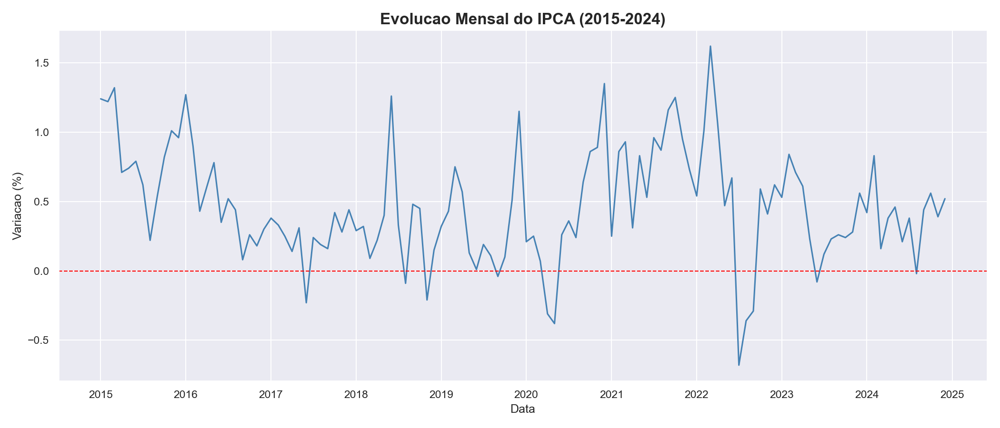
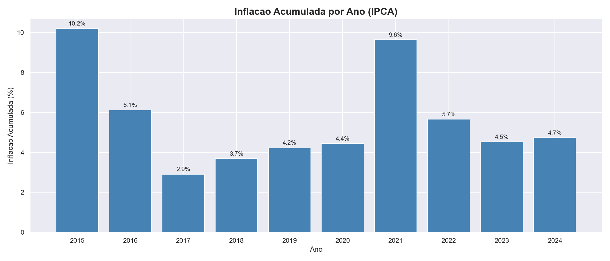
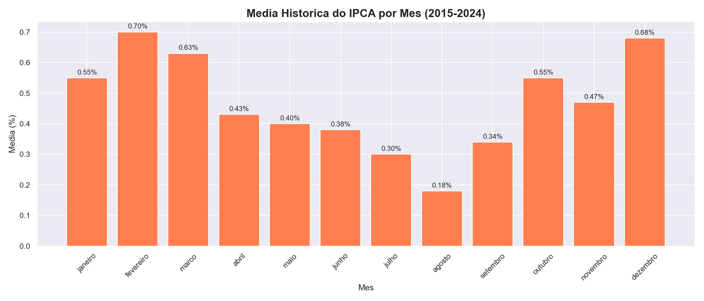

# Análise da Inflação Brasileira (IPCA 2015-2024)

Projeto de análise de dados sobre a evolução do IPCA (Índice Nacional de Preços ao Consumidor Amplo) 
no Brasil entre 2015 e 2024, utilizando Python, Pandas e SQL.

---

## Objetivos

- Coletar dados oficiais do IPCA direto do IBGE
- Limpar e transformar os dados com Pandas
- Armazenar em banco de dados SQLite
- Responder perguntas analíticas com SQL
- Visualizar os resultados com gráficos

---

## 🛠️ Tecnologias utilizadas

- Python 3.14
- Pandas
- Matplotlib / Seaborn
- SQLite3
- Jupyter Notebook

---

## Estrutura do projeto

ipca-analysis/
├── data/
│   ├── raw/              # Dados brutos do IBGE
│   └── processed/        # Dados limpos
├── database/
│   └── ipca.db           # Banco de dados SQLite
├── notebooks/
│   └── analise.ipynb     # Exploração dos dados
├── outputs/
│   └── graficos/         # Gráficos gerados
├── src/
│   ├── load_data.py      # Carrega dados no banco
│   ├── queries.py        # Consultas SQL analíticas
│   └── visualizacoes.py  # Geração de gráficos
├── requirements.txt
└── README.md

---

## Principais resultados

### Evolução mensal do IPCA


### Inflação acumulada por ano


### Média histórica por mês


---

## Como executar

**1. Clone o repositório**
```bash
git clone https://github.com/Mariano-dev648/ipca-analysis
cd ipca-analysis
```

**2. Crie e ative o ambiente virtual**
```bash
python -m venv venv
venv\Scripts\Activate.ps1
```

**3. Instale as dependências**
```bash
pip install -r requirements.txt
```

**4. Execute os scripts na ordem**
```bash
python src/load_data.py
python src/queries.py
python src/visualizacoes.py
```

---

## Fonte dos dados

Dados obtidos do [SIDRA/IBGE](https://sidra.ibge.gov.br/tabela/1737) — 
Tabela 1737: IPCA - Série histórica de variação mensal.

---

## Autor

Criado e Desenvolvido por: **[MARIANO LEMOS]** • [LinkedIn](https://www.linkedin.com/in/mariano-lemos-92761a217/) • [GitHub](https://github.com/Mariano-dev648)